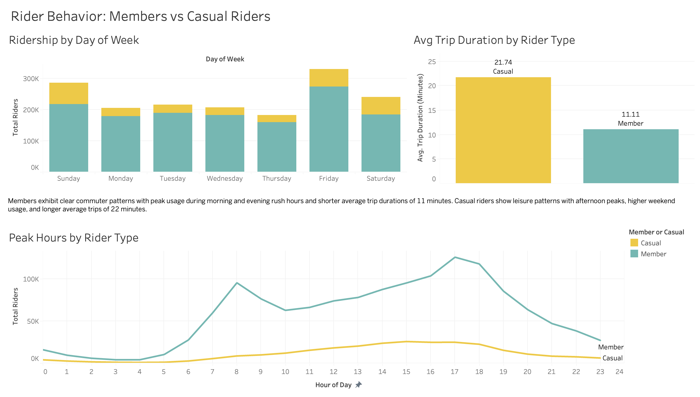
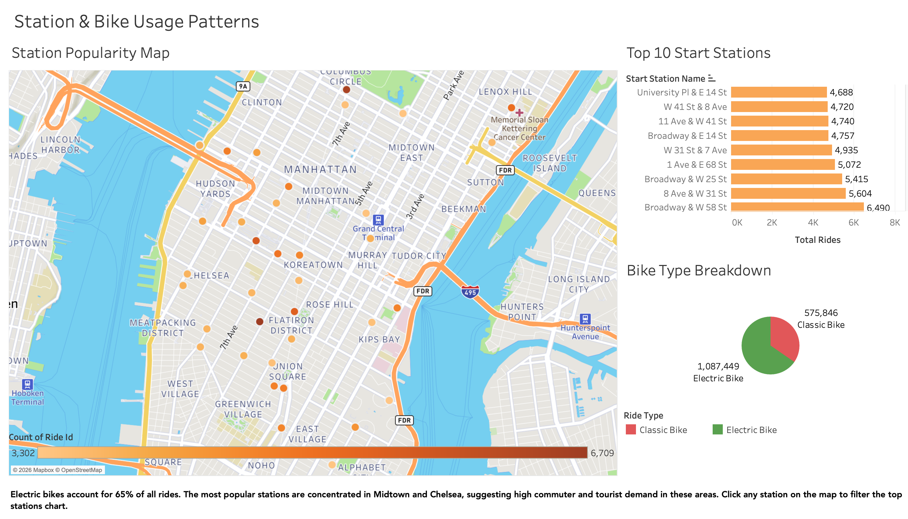
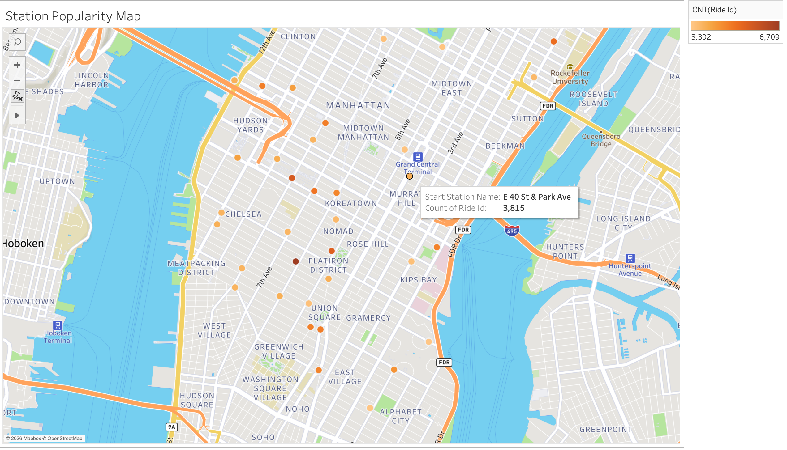

# 🚲 NYC Citi Bike Ridership Analysis | Jan - Mar 2024


---

## 📊 View the Full Interactive Dashboard

👉 **[Click here to explore the Tableau Public Dashboard](https://public.tableau.com/views/NYC_CitiBike_Analysis_2024/Story1?:language=en-US&publish=yes&:sid=&:redirect=auth&:display_count=n&:origin=viz_share_link)**

---

## 📌 Overview

This project analyzes over **1.6 million Citi Bike rides** from January through March 2024 to uncover two key phenomena about how New Yorkers use the bike-sharing program. The analysis is designed to help city officials and urban planners make data-driven decisions about the Citi Bike program.

---

## 📂 Project Structure

```
NYC-CitiBike-Tableau-Analysis/
│
├── Images/
│   ├── dashboard_1_rider_behavior.png
│   ├── dashboard_2_station_usage.png
│   └── station_map.png
├── .gitignore
└── README.md
```

---

## 📋 Dataset

- **Source:** [Citi Bike System Data](https://www.citibikenyc.com/system-data)
- **Period:** January, February, and March 2024
- **Files:** 8 CSV files unioned in Tableau
- **Total Records:** 1,663,295 rides
- **Fields:** ride_id, rideable_type, started_at, ended_at, start/end station name, start/end coordinates, member_casual

---

## 🔍 Phenomenon 1: Members vs Casual Riders Behave Very Differently



### Key Findings:

- **Members** show clear commuter patterns with two distinct peaks — morning rush around **8am** and evening rush around **5-6pm**
- **Casual riders** show a single gradual peak in the **afternoon around 3-5pm**, consistent with leisure and tourist use
- **Casual riders take trips nearly twice as long** — averaging **22 minutes** compared to **11 minutes** for members
- **Weekend casual ridership** is proportionally higher, further supporting the leisure use pattern
- **Friday is the busiest day** overall, while Thursday sees the lowest weekday ridership

### Insight:
Members are primarily using Citi Bike as a commuting tool for short, efficient trips. Casual riders are exploring the city at a leisurely pace. This distinction has important implications for pricing strategy, station placement, and bike availability planning.

---

## 🔍 Phenomenon 2: Station & Bike Type Popularity



### Key Findings:

- **Electric bikes account for 65%** of all rides (1,087,449) vs classic bikes at 35% (575,846)
- **W 21 St & 6 Ave** is the busiest start station, located in the heart of Chelsea
- The **top 10 busiest stations** are concentrated in Midtown and Chelsea, reflecting high commuter and tourist demand
- Electric bike preference is consistent across both member and casual rider groups

### Insight:
The strong preference for electric bikes suggests growing demand for e-bike infrastructure. The concentration of popular stations in Midtown and Chelsea indicates these areas may benefit from increased bike availability and more frequent rebalancing.

---

## 🗺️ City Official Map: Station Popularity



The interactive map plots the **top 50 busiest start stations** across New York City, with color intensity representing ride volume. Darker dots indicate higher ridership. The map reveals a clear concentration of activity in **Midtown Manhattan** and along the **west side of Manhattan**, with secondary clusters in **Brooklyn**.

---

## 📈 Summary of Key Metrics

| Metric | Value |
|--------|-------|
| Total Rides | 1,663,295 |
| Member Rides | ~74% |
| Casual Rides | ~26% |
| Electric Bike Share | 65% |
| Classic Bike Share | 35% |
| Avg Member Trip | 11 minutes |
| Avg Casual Trip | 22 minutes |
| Busiest Day | Friday |
| Busiest Hour (Members) | 5-6 PM |
| Busiest Hour (Casual) | 3-4 PM |
| Top Station | W 21 St & 6 Ave |

---

## 🛠️ Tools Used

| Tool | Purpose |
|------|---------|
| Tableau Public | Data visualization and dashboard creation |
| Citi Bike Open Data | Primary data source |

---

## 🎓 Context

This project was completed as part of the **Data Analytics and Visualization Bootcamp** at the University of Minnesota. It demonstrates applied data visualization, dashboard design, and data storytelling for a non-technical audience.

---

## 👩‍💻 Author

**Kat Chu**
- 🔗 [LinkedIn](https://www.linkedin.com/in/kat-chu/)
- 🐙 [GitHub](https://github.com/kat-chu)
- 📊 [Tableau Public](https://public.tableau.com/app/profile/kat.chu)
